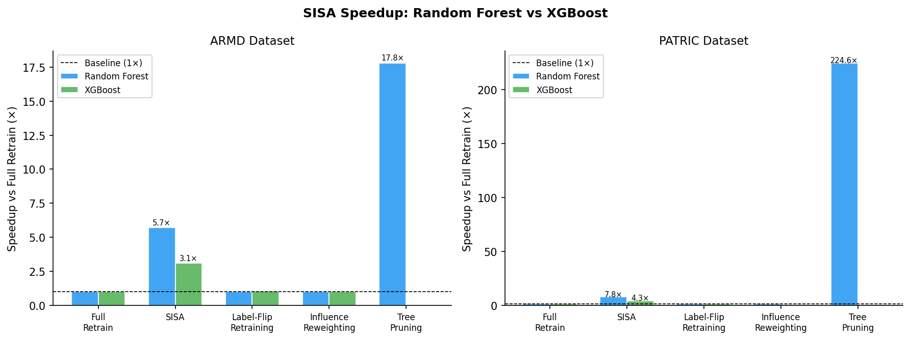
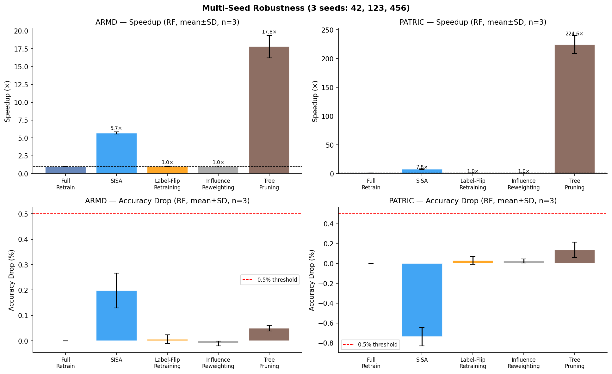
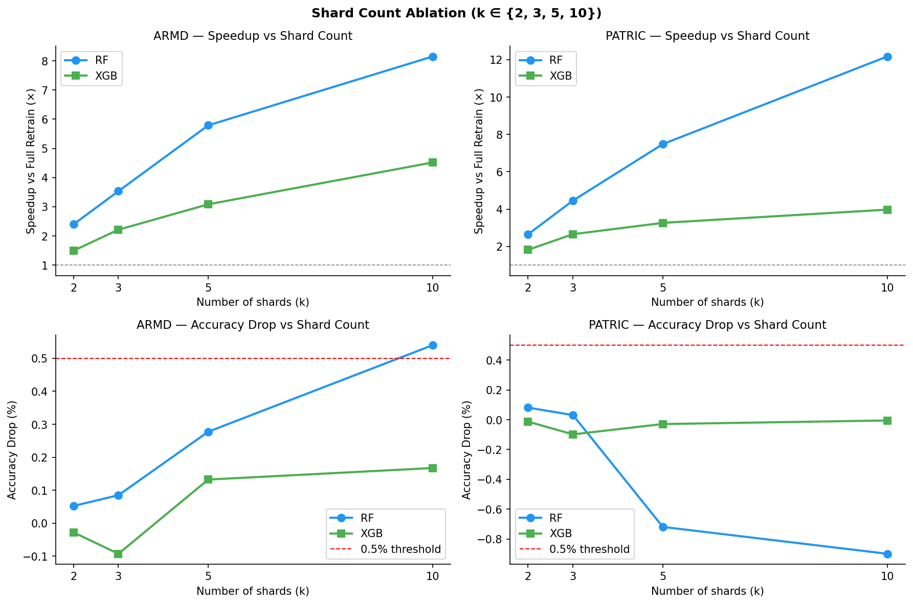
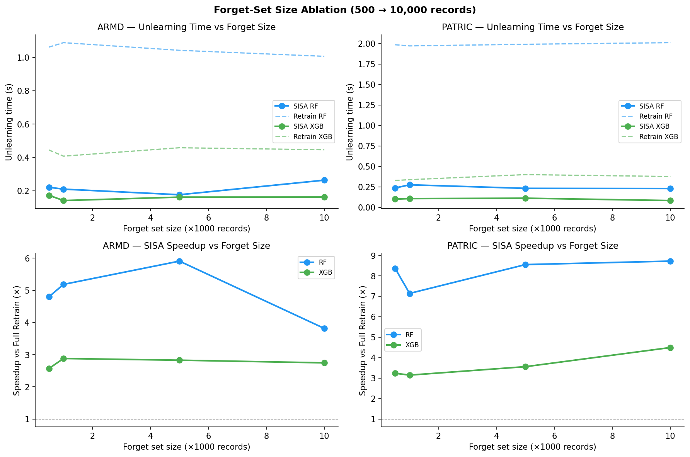
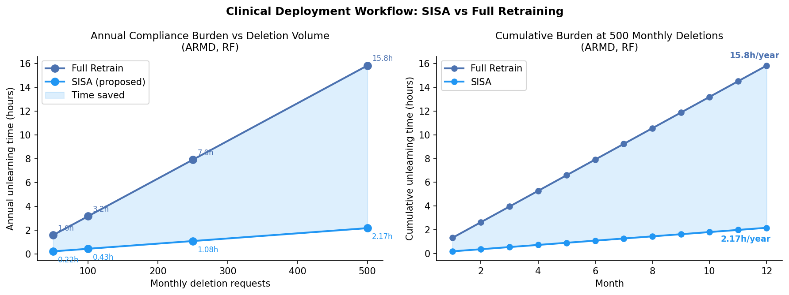

# Efficient Machine Unlearning for Antimicrobial Resistance Prediction in Clinical and Genomic Data

<div align="center">

[](#citation)
[](#overview)
[](#overview)
[](#methods)
[](#datasets)
[](#reproducibility)
[](#repository-structure)
[](#results)

**Official repository for the paper**  
**“Efficient Machine Unlearning for Antimicrobial Resistance Prediction in Clinical and Genomic Data”**

Target journal: **Artificial Intelligence in Medicine**

[Overview](#overview) •
[Highlights](#highlights) •
[Datasets](#datasets) •
[Methods](#methods) •
[Results](#results) •
[Figures](#figures) •
[Reproducibility](#reproducibility) •
[Citation](#citation)

</div>

---

## Overview

Clinical machine learning systems trained on patient data need practical mechanisms for responding to **right-to-erasure** requests without repeatedly retraining the full model. This repository supports a study of **Sharded, Isolated, Sliced and Aggregated (SISA)** training as an operational machine-unlearning mechanism for **antimicrobial resistance (AMR) prediction**.

The study evaluates SISA across two data modalities:

- **Clinical electronic health records (EHR)** from the Antibiotic Resistance Microbiology Dataset (ARMD)
- **Genomic surveillance data** from BV-BRC/PATRIC

The experiments compare SISA against full retraining and practical unlearning baselines using **Random Forest** and **XGBoost** models. The goal is to quantify whether shard-based retraining can reduce deletion-time cost while preserving predictive performance within a pragmatic operational accuracy threshold.

---

## Highlights

- **Two AMR modalities:** clinical EHR and genomic surveillance data.
- **Two model families:** Random Forest and XGBoost.
- **Three deterministic seeds:** 42, 123, and 456.
- **SISA speedups:** 3.08–7.76× over full retraining under the recommended `k=5` setting.
- **Accuracy preservation:** all mean SISA accuracy changes remain within a 0.5 percentage-point operational threshold.
- **Shard-count ablation:** `k ∈ {2, 3, 5, 10}` quantifies the speed–utility trade-off.
- **Forget-size ablation:** deletion batches from 500 to 10,000 records test scalability.
- **Clinical workflow projection:** estimates model-computation savings under repeated deletion requests.

---

## Paper at a Glance

| Item | Details |
|---|---|
| Title | **Efficient Machine Unlearning for Antimicrobial Resistance Prediction in Clinical and Genomic Data** |
| Authors | Saniya; Abdullah Ahmad Khan |
| Target journal | Artificial Intelligence in Medicine |
| Primary method | SISA training / shard-isolated retraining |
| Model families | Random Forest, XGBoost |
| Datasets | ARMD, BV-BRC/PATRIC |
| Main experiments | 3 seeds, shard ablation, forget-size ablation, timing tests |
| Primary claim | SISA reduces deletion-time retraining cost while preserving predictive utility under tested AMR settings |

---

## Datasets

### 1. ARMD

**Antibiotic Resistance Microbiology Dataset**

- **Modality:** Clinical electronic health records
- **Size:** 1,245,767 records
- **Source:** Stanford Health Care / MIT ClinicalML
- **Access:** Data Use Agreement required
- **Use in this study:** AMR prediction benchmark for clinical EHR model maintenance

### 2. BV-BRC / PATRIC

**Bacterial and Viral Bioinformatics Resource Center / PATRIC genomic AMR data**

- **Modality:** Genomic surveillance
- **Size:** 400,372 records
- **Source:** NIH BV-BRC / GenBank-derived resources
- **Access:** Public API-based access
- **Use in this study:** Genomic AMR prediction benchmark for model-maintenance evaluation

> **Note:** Raw ARMD data are not redistributed in this repository because they are governed by the original Data Use Agreement. Users must obtain ARMD directly from the official source.

---

## Methods

### Compared Methods

| Method | Description |
|---|---|
| **Full Retraining** | Gold-standard baseline: retrain the model from scratch after deleting requested records |
| **SISA Training** | Partition data into independent shards and retrain only affected shard models |
| **Label-Flip Retraining** | Heuristic baseline that relabels forget-set samples and retrains |
| **Influence-Inspired Reweighting** | Practical down-weighting comparator using near-zero sample weight for forget records |
| **Selective Tree Pruning** | Random-Forest-only baseline that removes trees based on forget-set behavior |

### Core Experimental Configuration

```text
Models: Random Forest, XGBoost
Seeds: 42, 123, 456
Primary SISA shard count: k = 5
Shard ablation: k = 2, 3, 5, 10
Forget-size ablation: 500, 1,000, 5,000, 10,000 records
Primary utility metrics: accuracy, AUC-ROC
Privacy-oriented proxy: MIA confidence gap
Efficiency metrics: wall-clock retraining/unlearning time and speedup vs full retraining
```

### Timing Scope

Reported wall-clock times measure model retraining or unlearning computation on already prepared feature matrices. They do **not** include dataset download, disk I/O, data cleaning, feature engineering, clinical validation, approval, redeployment, monitoring, or audit-documentation overhead. Therefore, the relative speedup over full retraining is the primary efficiency evidence.

---

## Results

### Main SISA Results at `k=5`

| Dataset | Model | SISA accuracy | SISA speedup | Accuracy drop | Status |
|---|---:|---:|---:|---:|---|
| ARMD | Random Forest | 0.8475 ± 0.0004 | 5.70 ± 0.15× | 0.20 percentage points | Within threshold |
| ARMD | XGBoost | 0.8615 ± 0.0000 | 3.08 ± 0.17× | 0.13 percentage points | Within threshold |
| PATRIC | Random Forest | 0.6862 ± 0.0016 | 7.76 ± 0.40× | −0.74 percentage points | Within threshold |
| PATRIC | XGBoost | 0.6940 ± 0.0013 | 4.25 ± 0.26× | −0.05 percentage points | Within threshold |

Negative accuracy drops indicate that SISA achieved marginally higher test accuracy than full retraining in that setting. These effects should be interpreted as small benchmark variations, not as systematic accuracy gains.

### Timing Significance

SISA timing reductions relative to full retraining were consistent across the four dataset–model settings. The paper reports paired timing tests across three deterministic seeds as **indicative**, because `n=3` seeds is too small for strong statistical claims.

| Dataset | Model | SISA time | Full retraining time | p-value |
|---|---:|---:|---:|---:|
| ARMD | Random Forest | 0.174 ± 0.011 s | 0.991 s mean | 0.000480 |
| ARMD | XGBoost | 0.131 ± 0.013 s | 0.406 s mean | 0.015025 |
| PATRIC | Random Forest | 0.249 ± 0.018 s | 1.928 s mean | 0.000153 |
| PATRIC | XGBoost | 0.088 ± 0.003 s | 0.374 s mean | 0.001071 |

---

## Figures

<details open>
<summary><b>Figure A — Model comparison</b></summary>

<p align="center">
  
</p>

SISA speedup comparison across Random Forest and XGBoost on ARMD and PATRIC.

</details>

<details>
<summary><b>Figure B — Multi-seed robustness</b></summary>

<p align="center">
  
</p>

Robustness across seeds 42, 123, and 456, including speedup and accuracy-drop behavior.

</details>

<details>
<summary><b>Figure C — Shard-count ablation</b></summary>

<p align="center">
  
</p>

Effect of shard count `k ∈ {2, 3, 5, 10}` on speedup and accuracy drop.

</details>

<details>
<summary><b>Figure D — Forget-size ablation</b></summary>

<p align="center">
  
</p>

Deletion-batch scalability from 500 to 10,000 records.

</details>

<details>
<summary><b>Figure E — Clinical workflow projection</b></summary>

<p align="center">
  
</p>

Projected annual compute burden for repeated deletion requests under full retraining versus SISA.

</details>

---

## Repository Structure

```text
.
├── README.md
├── armd_data/
│   └── ARMD-related scripts or metadata
├── patric_data/
│   └── BV-BRC/PATRIC-related scripts or metadata
├── configs/
│   └── experiment configuration files
├── data/
│   └── dataset loading or preprocessing utilities
├── figures/
│   ├── figA_model_comparison.png
│   ├── figB_multiseed_robustness.png
│   ├── figC_shard_ablation.png
│   ├── figD_forget_size.png
│   └── figE_clinical_workflow.png
├── results/
│   └── CSV outputs, LaTeX tables, and summary statistics
├── scripts/
│   └── experiment and figure-generation scripts
└── paper/
    └── manuscript files, if included
```

---

## Reproducibility

### Typical Workflow

```bash
# 1. Install dependencies
pip install -r requirements.txt

# 2. Run the full experiment pipeline
python run_all.py

# 3. Inspect generated outputs
# Results are written to results/
# Figures are written to figures/
```

### Expected Output Files

```text
results/exp1_main_results.csv
results/exp2_shard_ablation.csv
results/exp3_forget_size.csv
results/exp4_pvalues.csv
results/exp4_summary_stats.csv
figures/figA_model_comparison.png
figures/figB_multiseed_robustness.png
figures/figC_shard_ablation.png
figures/figD_forget_size.png
figures/figE_clinical_workflow.png
```

### Reproducibility Notes

- ARMD must be obtained separately under its Data Use Agreement.
- BV-BRC/PATRIC data should be accessed through the official BV-BRC API.
- Wall-clock times are hardware- and implementation-dependent.
- The main efficiency metric is speedup relative to full retraining under the same local environment.
- Timing results exclude data download, preprocessing, clinical validation, redeployment, and audit overhead.

---

## Data Availability

- **ARMD:** available from MIT ClinicalML under a Data Use Agreement at `https://clinicalml.org/data/amr-dataset/`.
- **BV-BRC/PATRIC:** publicly available through the NIH BV-BRC API at `https://www.bv-brc.org/api/genome_amr/`.
- **Code and results:** experiment scripts, figures, tables, and result-generation utilities are provided in this repository.

Raw restricted data are not redistributed. Users are responsible for complying with the original dataset licenses, access terms, and ethical requirements.

---

## Limitations

This repository supports an operational benchmark study. It does not claim certified deletion or legal compliance by itself. Important limitations include:

- privacy verification uses a lightweight MIA confidence-gap proxy;
- stronger shadow-model or likelihood-ratio attacks are future work;
- runtime values are controlled benchmark measurements, not end-to-end hospital deployment times;
- real-world deletion requests may affect multiple shards;
- patient-level sharding policies are recommended for deployment but require site-specific engineering;
- clinical validation should include additional calibration and subgroup analyses before deployment.

---

## Intended Audience

This repository is relevant to researchers and practitioners working on:

- machine unlearning;
- clinical AI governance;
- privacy-aware machine learning;
- antimicrobial resistance prediction;
- healthcare model maintenance;
- right-to-erasure workflows;
- tabular EHR and genomic surveillance modelling.

---

## Citation

If you use this repository or build on this work, please cite the paper:

```bibtex
@article{saniya_khan_2026_amr_unlearning,
  title   = {Efficient Machine Unlearning for Antimicrobial Resistance Prediction in Clinical and Genomic Data},
  author  = {Saniya and Khan, Abdullah Ahmad},
  journal = {Artificial Intelligence in Medicine},
  year    = {2026},
  note    = {Manuscript submitted}
}
```

---

## License

This repository is provided for research and reproducibility purposes. Dataset access remains governed by the original data providers. Raw restricted datasets are not redistributed.

---

## Contact

**Abdullah Ahmad Khan**  
School of Information Technology, Murdoch University  
Perth, Western Australia, Australia

For questions, please open a GitHub issue or contact the corresponding author.

---

<div align="center">

If this repository is useful, please consider starring it.

</div>
